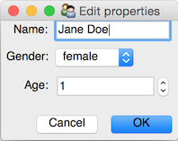
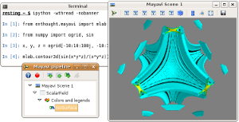
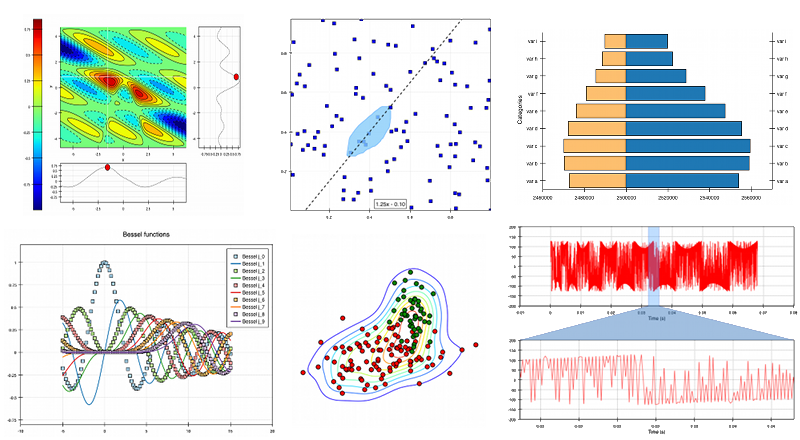

.. Enthought Tool Suite documentation master file, created by
   sphinx-quickstart on Sat Jul 13 15:32:51 2019.
   You can adapt this file completely to your liking, but it should at least
   contain the root `toctree` directive.

====================
Enthought Tool Suite
====================

The Enthought Tool Suite (ETS) is a collection of open-source components
developed by Enthought, our partners and the scientific Python community,
which we use every day to construct custom scientific applications. It
includes a wide variety of components, including:

- an `extensible application framework <http://docs.enthought.com/envisage>`_
- `application building blocks <http://docs.enthought.com/traitsui>`_
- `2-D <http://docs.enthought.com/chaco>`_ and `3-D <http://docs.enthought.com/mayavi/mayavi>`_ graphics libraries
- scientific and math libraries
- developer tools

The cornerstone on which these tools rest is the `Traits <http://docs.enthought.com/traits>`_
package, which provides the observer pattern in Python; its features include
initialization, validation, delegation, notification, and visualization
of typed attributes.

Community support for ETS is available on the `ets-users group <https://groups.google.com/forum/#!forum/ets-users>`_,
and on `stackoverflow (tag "enthought") <https://stackoverflow.com/search?q=%23enthought>`_ .

Traits: run-time type-checking and reactive programming
=======================================================

Traits provides :py:mod:`~.dataclasses`-like type-checked attributes, the
ability to watch and react to changes in attribute values, together with
(optional) automatic GUI generation.

- Documentation: `<http://docs.enthought.com/traits>`_
- Source: `<http://github.com/enthought/traits>`_

TraitsUI: easy GUI-building
===========================

TraitsUI provides a declarative GUI system built on top of Traits.  Reasonable
default values allow incremental improvement from an automatically generated
GUI through to highly customized behaviour.  TraitsUI uses and can interoperate
with PyQt, PySide or WxPython.

- Documentation: `<http://docs.enthought.com/traitsui>`_
- Source: `<http://github.com/enthought/traitsui>`_

Mayavi: applicaiton and 3D visualization library
================================================

Mayavi provides a 3D visualization application, a library for 3D plotting within
IPython, and a library for embedding 3D visualizations into GUI applications
in TraitsUI, PyQt, PySide and WxPython.

- Documentation: `<http://docs.enthought.com/apptools>`_
- Source: `<http://github.com/enthought/apptools>`_

Chaco: Interactive 2D plotting library
======================================

Chaco provides an interactive 2D plotting library for GUI applications in TraitsUI,
PyQt, PySide and WxPython.

- Documentation: `<http://docs.enthought.com/chaco>`_
- Source: `<http://github.com/enthought/chaco>`_

Envisage: plug-in application framework
=======================================

Envisage is a plug-in application framework for Python inspired by the plug-in
framework of the `Eclipse <https://www.eclipse.org/>`_ IDE.

- Documentation: `<http://docs.enthought.com/envisage>`_
- Source: `<http://github.com/enthought/envisage>`_

Pyface: low level GUI components
================================

Pyface provides a traits-aware wrapper around basic GUI components, providing
a toolkit-agnostic framework for building application UIs.  Pyface uses and can
interoperate with PyQt, PySide or WxPython.

- Documentation: `<http://docs.enthought.com/pyface>`_
- Source: `<http://github.com/enthought/pyface>`_

Apptools: GUI application components and systems
================================================

Apptools provides a collection of utilities and systems for building GUI
applications, including logging, undo/redo, application-wide selection,
macro recording.

- Documentation: `<http://docs.enthought.com/apptools>`_
- Source: `<http://github.com/enthought/apptools>`_

Kiva and Enable: 2D vector drawing and interaction
==================================================

Kiva provides a 2D vector drawing abstraction over a variety of backends,
including AGG, Cairo, Quartz, QPainter, PDF and PostScript.  Enable adds
Traits-based interactivity and event-handling on top of Qt or Wx.

- Documentation: `<http://docs.enthought.com/enable>`_
- Source: `<http://github.com/enthought/enable>`_

Codetools: Python code analysis and execution
=============================================

Codetools provides tools for analyzing data flow throught Python
code and advanced execution contexts that permit observation of
changes to variables as code is executed.

- Documentation: `<http://docs.enthought.com/codetoold>`_
- Source: `<http://github.com/enthought/codetools>`_

SciMath: Scientific utilities including units
=============================================

Scimath provides a collection of scientific computation utilities, including
scalar and numpy array quantities with physical units.

- Documentation: `<http://docs.enthought.com/scimath>`_
- Source: `<http://github.com/enthought/scimath>`_

GraphCanvas: 2D network visualization (under development)
=========================================================

GraphCanvas provides interactive 2D representations of networks and graphs using
Enable and NetworkX.

- Documentation: `<http://docs.enthought.com/graphcanvas>`_
- Source: `<http://github.com/enthought/graphcanvas>`_
